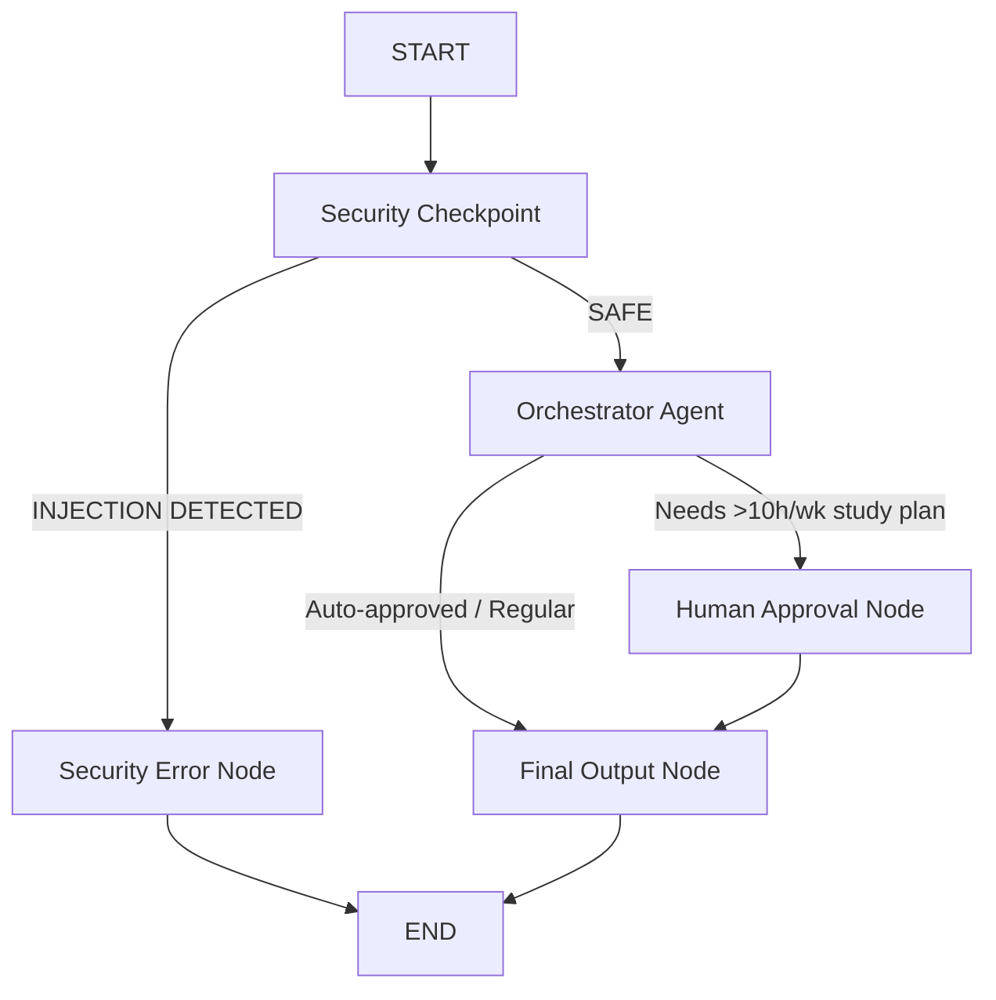

# Submission Writeup: StudySync Academic Planner Agent

## Problem Statement
Students face challenges in breaking down syllabus materials into actionable schedules, keeping track of deadlines, and applying effective cognitive study strategies. StudySync solves this by offering an automated, secure concierge agent that translates course expectations into personalized active learning plans.

## Solution Architecture
The application runs as a directed graph workflow.

## Concepts Used

- **ADK 2.0 Multi-Agent Workflow:** Implemented using `google.adk.workflow.Workflow` in [agent.py](file:///c:/Users/thanm/Downloads/adk%20workspace1/study-sync/app/agent.py).
- **LlmAgents:** Specialized agents for Orchestrator, Syllabus Parsing, and Schedule Generation.
- **AgentTool:** Handled delegating parsing and scheduling tasks from the Orchestrator to the specialized agents.
- **MCP Server:** Local server implemented using `FastMCP` in [mcp_server.py](file:///c:/Users/thanm/Downloads/adk%20workspace1/study-sync/app/mcp_server.py).
- **Security Checkpoint:** Implemented regex for PII scrubbing and keyword matching for injection defense.
- **Agents CLI:** Scaffolding and playground integration.

## Security Design
- **PII Scrubbing:** Automatically redacts emails, phone numbers, and SSNs in the initial workflow node.
- **Injection Detection:** Flags known jailbreak/prompt injection attempts, diverting execution to a safe termination node.
- **Structured Audit Logging:** Outputs event records in JSON structure with severity levels.

## MCP Server Design
The local Model Context Protocol server exposes three tools:
- `parse_syllabus_dates`: Rule-based topic/exam triage.
- `generate_calendar_weeks`: Outputs start-to-finish dates.
- `suggest_focus_techniques`: Maps subject difficulty to Feynman/Pomodoro strategies.

## HITL Flow
If a student requests more than 10 hours of study per week, the agent routes to a `RequestInput` node requiring approval (`study_plan_approval`), ensuring students do not generate exhausting, counterproductive routines without confirmation.

## Demo Walkthrough
1. **Auto-Approved Path:** Providing a normal syllabus generates a 4-week calendar and study strategy.
2. **HITL Path:** Requesting an intensive 12-hour schedule prompts the user to approve before compilation.
3. **Safety Path:** Injecting override instructions blocks execution.

## Impact
StudySync decreases organizational stress for students, applying evidence-based cognitive science techniques to personal schedules.
